## Milestone 4 – Keep Rolling Website

I am creating a website for Brazilian Jiu Jitsu enthusiasts to purchase instructionals/courses and clothing/merchandise.

## UX

_Overview_

The aim of the project is to create an ecommerce website where users can purchase items of their choice. 
The website is created for those who train Brazilian Jiu Jitsu, who are often looking for courses/instructional material they can use to improve their game, especially in recent times where many are in lockdown, and unable to train Jiu Jitsu.
The website will also sell Jiu Jitsu merchandise, such as clothing they can use whilst training.
Users will want to easily be able to browse and purchase items, and the website owner will want to showcase their products postiviely to drive sales. 
The website is designed to be suitable for use on all devices, from desktop to mobile. 
Due to timing constraints, I will be taking the approach of producing a minimum viable product for this project submission, with the aim of improving/further developing the site in the future.

_User Stories_

As a user of the site:

	*	I want to understand the website's purpose
	*	I want to be easily able to view a list of all products by category
	* 	I want to be able to view specific product details
	*	I want to be easily able to purchase products

As the site owner:

	* 	I want the website to provide a platform for users to purchase items
	*	I want to be able to add/edit/delete products

As a/an | I want to be able to | So that I can 
------- | -------- | ------- 
Shopper | View a list of products | Select some to purchase 
Shopper | View individual product details | See the price/description/rating/sizes 
Shopper | View the total of my purchases at any time | Avoid spending too much 
Site User | Easily register for account | Have an account/view my profile 
Site User | Easily login/logout | Access my account  
Site User | Easily recover my password | Recover access to account 
Site User | Receive email confirmation after registering | Verify registration successful 
Site User | Have a personalised user profile | View order history/save payment info 
Shopper | Search for a product | Find a specific product 
Shopper | Easily see what I've searched for | Quickly decide if what I want is there
Shopper | Select size/qty of product when purchasing | Ensure I don't select wrong product/size 
Shopper | View bag items | See total cost/all items I'll receive 
Shopper | Adjust qty of items in my bag | Easily make changes to bag before checkout 
Shopper | Easily enter payment info | Checkout quickly 
Shopper | View an order confimation after checkout | Ensure no mistakes made 
Store Owner | Add a product | Add new items to store 
Store Owner | Edit/update a product | Change product details
Store Owner | Delete a product | Remove items not for sale 

_5 S's_

**Strategy** 

The primary goal is to create a ecommerce website for Brazilian Jiu Jitsu enthusiasts to purchase instructionals/courses and clothing/merchandise.

**Scope** 

The overall look and feel of the website was influenced by researching similar websites (credits at end):
    -   These are simple/clean in design
    -   There is a hero image explaining the site's purpose, along wih some introductory text
    -   There is a menu where you can display product listings by category (usually on the navbar)
    -   There is an icon to login and/or display your shopping bag on the navbar
    -   Products are listed in a "grid" style with each product having it's own image and high-level description
    -   Clicking on the product image takes you to the product page with it's detailed description
    -   There is a search box to search for products (usually on the navbar)
    -   Selected items are placed in a "shopping bag" page where users can see items selected for purchase before confirming their buy

**Structure** 

The website will consist of the following:

1. Homepage:
	- Hero image with explanatory text giving high-level overview of site.
	- Navbar with facility to search products, links to view products by categories, login/signup to their account, and view their shopping bag.
	- Links to shopping pages highlighted/centred in page to encourage users to start shopping.
	- Footer with more info on the website, and contact details/social links.

2. Products:
	- Two dedicated product pages for each product category, listing all products in that catgeory in a "card" format, each card being clickable to display that particular products detatils.

3. Product Detail:
	- Per above, will display the individual product details, and give the user the facility to "add to bag"

4. Shopping Bag:
	- Page to display all products in bag, before making a purchase.

5. Purchase/checkout:
	- Page for user to facilitate purchase, allowing entering oof payment details. 

6. Login/Signup:
	- Form for users to login if existing user or signup if new user.

7. Profile:
	- For existing users, shows personal details (editable by user) and order history.

**Skeleton** 

Link to wireframes.

There are some minor changes to the deployed site and the initial wireframes, these changes were made mainly due to time constraints:
- Homepage: consists of hero-image only, no addditional "about" section (included additional "about" info in footer instead).
- Homepage: no additional links to "Courses" or "Clothing" at bottom of page, felt unneccesary as hero-image already has these links.

**Surface** 

- The colour scheme will be influenced from the research detailed in the scope section above.
- The websites tend to use simple colour schemes, with only 2/3 colours often being used.
- This website will use black, red, white, and grey.
- This combination is used to keep the site looking simple/clean.
- Red is associated with feelings of excitement, and wanting to take action, which is suited to this website. Source: Crazy Egg
- I wanted a bold dynamic font for the main logo headers/buttons etc, with a more simple easy-to-read text for any longer texts like product descriptions. After experimenting with various font combinations, I settled with Oswald/Montserrat combination, as this met these requirements.

## Features

_Existing_

Homepage:
 - The site is styled using bootstrap for responsive design
 - Fixed navbar, incorporating search form and site navigation links
 - Buttons linking to product areas of the site (categories used to show appropriate products)
 - Footer with social media links
 - Toasts used to display info for user on login/logout etc

Products:
 - Crispy forms used to display product info
 - Bootstrap card format to display product image/details

Product Details:
 - Crispy forms used to display product info
 - Quantity selector input form to add products to bag

Bag:
- Crispy forms used to display product info
- Grid/table format used to display products

Checkout:
- Input form to enter details
- Stripe card details form to facilitate payment

Login/Logout:
- Input forms for logging in/signing up

Profile:
- Crispy forms to display user info/order history
- Input forms for amending details

Other:
- The website has been linked to Amazon Web Services to store any static files/images there automatically
- The website has been linked to Stripe to facilitate payments
- The website has been linked to a Gmail account to facilitate sending of emails on registering/placing an order

_Left to Implement_

The following features were considered during the build of the site, however due to time constraints, these were not included in this version, but could be added at a later date:

- More details included in homepage explaining the site.
- More dynamic media on the homepage i.e. videos for better user experience.
- Actual contact form for user queries (email address included in footer to partially address this).
- More product details, particularly for courses, could include a video preview, and a curriculum detailing what the course covers.
- An actual account so users can signup for mailing lists/discounts etc.
- More professional logo.
- Although I believe the search feature is more likely to be used for this type of site, filtering/sorting options could be included on the product listing pages, i.e. sorting by rating/price, for better user experience.
- More product categories, for example accessories.
- More tailored toast messages.
- For courses products, it is not neccesary to include a quantiy selector, as there isn't a need to buy more than 1 online course, so this can be removed from the courses products.
- See unresolved bugs section in [Testing](...) for further features left to implement.

## Technologies Used

Languages:
- 	HTML5
-	CSS3
-	Javascript
-	Python 

Frameworks:
- 	Django
-   Bootstrap
-   Jquery

Storing/editing/deploying Code:
-	Gitpod
-	Github
-   Heroku

Storage/Database:
-   Amazon Web Services (to store static/image files)
- 	Heroku Postgres (for database)

Payment Handling:
- 	Stripe (for facilitating payments)

Other:
-   Google Fonts
- 	Font Awesome

## Testing

Testing documentation can be found [here](...).

## Deployment

_Github_

The source code for this site is in GitHub.

To clone the code from GitHub:

1.	On GitHub, navigate to the main page of the repository.
2.	Above the list of files, click Code.
3.	To clone the repository using HTTPS, click HTTPS under "Clone".
4.	Open Git Bash.
5.	Change the current working directory to the location where you want the cloned directory.
6.	Type git clone, and then paste the URL you copied earlier:
    ```$ git clone https://github.com/YOUR-USERNAME/MS4_KeepRolling.git```
7.	Press Enter to create your local clone.
8.  Create your own env.py file to store variables, and ensure this is listed in your .gitignore file to keep these from being displayed publicly.

_Deployment to Heroku_

Heroku is used to deploy the app:

1.	When logged into your account, create new app:
    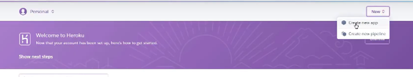

2.	Choose app name and your closest region:

	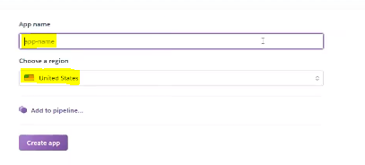 

3.	On Resources tab, provision Heroku Postgres (use the free plan):

    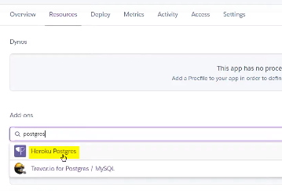 
	 
4.	Back in gitpod, install the following via these commands:
	 - ```pip3 install dj database url```
	 - ```pip3 install psycopg2 binary```

5.	Freeze the requirements so this is updated in the requirements.txt file to make sure Heroku installs all apps when deployed:
	- ```pip3 freeze > requirements.txt```

6.	To get stores database setup, go to settings.py an import dj_database_url:

    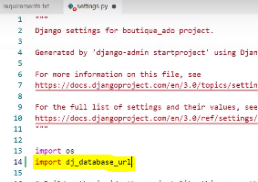 

7.	Down in the databases setting, comment out default configuration and replace the default database with a call to dj_database_url.parse, and give it the database URL from Heroku in the brackets (from your config variables in your app settings tab):

    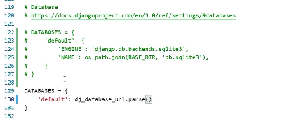 

8.	Now run all migrations again, by running:
	- ```python 3 manage.py migrate```

9.	Then create a superuser to log in with:
	- ```python3 manage.py create superuser```

10.	Back in settings.py remove the Heroku database config, and uncomment the original so our database URL doesn't end up in version control:
    
    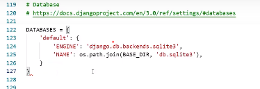 

11.	Then commit to github.

12.	Use an if statement in settings.py, so when app is running on Heroku, where database URL environment variable is defined, we connect to Postgres, otherwise we connect to sqlite:
    
    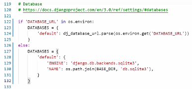 

13. Install unicorn, which will act as our webserver, then freeze that into requirements.txt:
	- ```pip3 install gunicorn```
	- ```pip3 freeze > requirements.txt```

14.	Now create Procfile, and enter the following to tell Heroku to create a web dyno, which will run unicorn and serve our django app:
	```web: gunicorn APP_NAME.wsgi:application```

15.	Temporarily disable collectstatic:
    
     

16.	Add the hostname of our Heroku app to allowed hosts in settings.py, add localhost aswell:
	ALLOWED_HOSTS = ['YOUR-APP-NAME.herokuapp.com', 'localhost']

17.	Then add/commit changes to github.

18.	To deploy to Heroku, enter (you may need to initialize your Heroku git remote if you created your app on the website rather than the CLI):
    
     

19.	To automatically deploy on Heroku when we commit to github, on your Heroku dashboard go to Deploy > select Github, and search for your repository, then click Connect:
    
    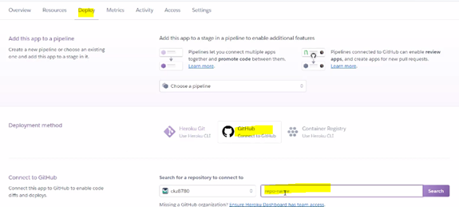 

20.	Click to enable automatic deploys:
    
    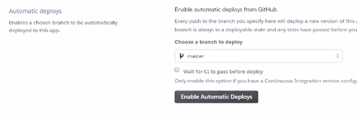 

21.	You need a new secret key to enter in you Heroku Config Vars (you can use an online Django secret key generator to do this):
    
    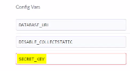 

22.	Now you can replace the secret key in settings.py with a call to get this from the environment:
    
    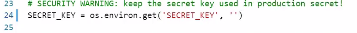 

23.	Commit/push these changes to github.

_AWS_

AWS is a cloud based storage service, used to store static files and images:

1.	After creating an AWS account (using the free version will be sufficient), access the AWS management console in your account.

2.	Find s3 by searching for this in services.

3.	Open s3 and create a new bucket.

4.	Enter a name for your bucket/select your closest region.

5.	Uncheck the block public access box, and create the bucket.

6.	Once created, click on the bucket and enter the following settings:
	-	Under Properties, turn on static website hosting
	- 	Under Permissions, paste in the CORS configuration:
	```
        [
 		    {
     		    "AllowedHeaders": [
         		    "Authorization"
     			    ],
     		    "AllowedMethods": [
       			    "GET"
     			    ],
     		    "AllowedOrigins": [
         		    "*"
     			    ],
    		    "ExposeHeaders": []
 		    }
	    ] ```

    -	Go to the bucket policy tab and select, policy generator so we can create a security policy for this bucket.
    -	The policy type is going to be s3 bucket policy, allow all principals by using a star, and the action will be, get object
    -	Copy the ARN which stands for Amazon resource name from bucket policy tab and paste it into the ARN box here at the bottom, then click Add Statement, then click Generate Policy then copy this policy into the bucket policy editor.
    -	Before clicking Save, because we want to allow access to all resources in this bucket, add add a slash star onto the end of the resource key
    -	Go to the access control list tab, and set the list objects permission for everyone under the Public Access section

7.	With our s3 bucket ready to go. Now we need to create a user to access it. do this through another service called Iam which stands for Identity and Access Management.

8.	Go back to the services menu and open Iam

9.	Click groups then create a new group (keep clicking through to Create Group)

10.	Create the policy used to access our bucket by clicking policies and then create policy

11.	Go to the JSON tab and then select import managed policy, then search for s3 and then import the s3 full access policy

12.	Get the bucket ARN from the bucket policy page in s3, and paste that in the JSON section

13.	Now click review policy, give it a name and a description, and then click create policy

14.	Now attach the policy to the group we created, go to groups, click manage my group, click attach policy, search for the policy we just created and select it, and click attach policy

15.	Create a user to put in the group. On the user's page, I'll click add user, create a user, give them programmatic access, then select next

16.	Now add user to your group. Important: Now download the CSV file which will contain this users access key and secret access key which we'll use to authenticate them from our Django app (cannot access this again so do this now)

17.	To Connect Django to s3 bucket, Install 2 new packages:
    -	```pip3 install boto3```
    -	```pip3 install django-storages```

18.	Then freeze requirements:
    -	```pip3 freeze > requirements.txt```

19.	Add ‘storages’ to installed apps on settings.py

20.	To connect Django to s3 we need to add some settings in settings.py to tell it which bucket it should be communicating with:
 
21.	Go to Heroku and add our AWS keys to the config variables, aswell as adding that key called USE_AWS which I'll set to true

22.	Also remove the disable collectstatic variable

23.	In our settings file, we need to tell django where our static files will be coming from in production
    
    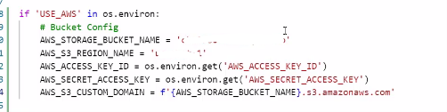 

24.	Create a file called custom storages:

    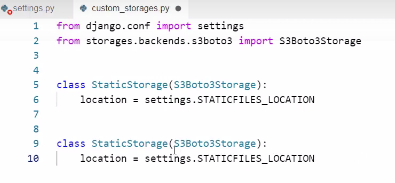 
 
25.	Go to settings.py, tell it that for static file storage we want to use our storage class we just created, and that the location it should save static files is a folder called static. Do the same thing for media files by using the default file storage and media files location settings

    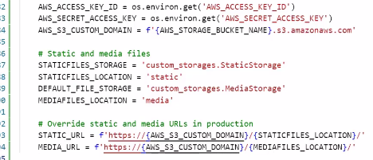 

26.	Add/commit changes in github.

## Credits

_Tutorials_

I used the Code Institute Boutiqu Ado Mini-Project by [Chris Zielinski](https://code-institute-room.slack.com/team/U9QSX6HCG) as the main basis of my own project.

_Slack Community_

I was able to resolve some issues encountered with deployment after searching on Slack in the Code Institute community, in particular how to login to Heroku using the CLI terminal, and creating a superuser once the app is deployed to Heroku.

_Guides_

I used [The Site Wizard](https://www.thesitewizard.com/css/rectangular-box-border.shtml) to help with creating a boxed logo.
 
_Research_

I used the following websites as a reference in the design process:

 - [The Grapple Club](https://thegrappleclub.com/)
 - [Tatami Fightwear](https://www.tatamifightwear.com/)

_Images_

Hero image on homepage from [Wikimedia Commons](https://commons.wikimedia.org/wiki/File:Jiu_jitsu_submission.png).

Product images are from [The Grapple Club](https://thegrappleclub.com/) and [Tatami Fightwear](https://www.tatamifightwear.com/): no copyright infringement is intended, this project is purely for educational purposes only, the images will be removed/changed after the project is submitted and graded.

_Text_

Text in the hero image and product descriptions have been amended from [The Grapple Club](https://thegrappleclub.com/) and [Tatami Fightwear](https://www.tatamifightwear.com/): no copyright infringement is intended, this project is purely for educational purposes only, the text will be removed/changed after the project is submitted and graded.